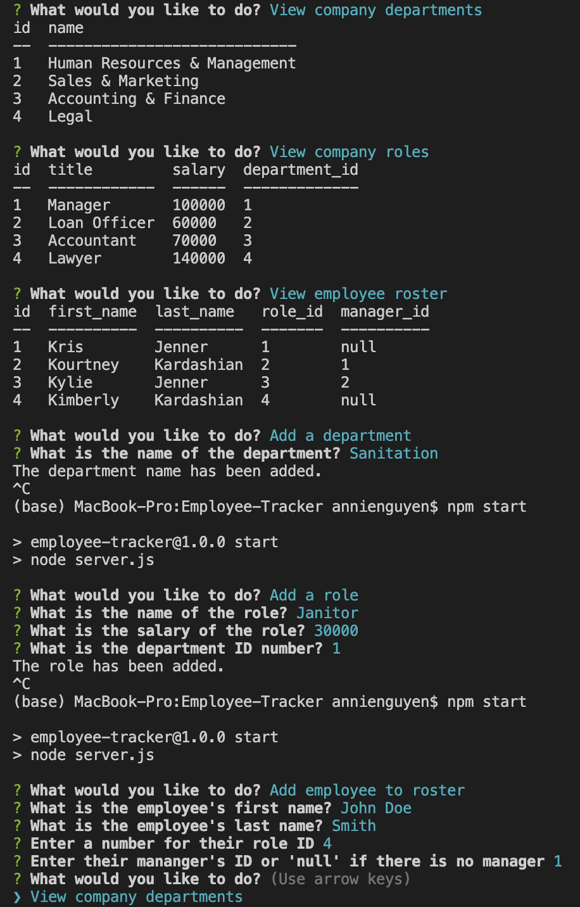
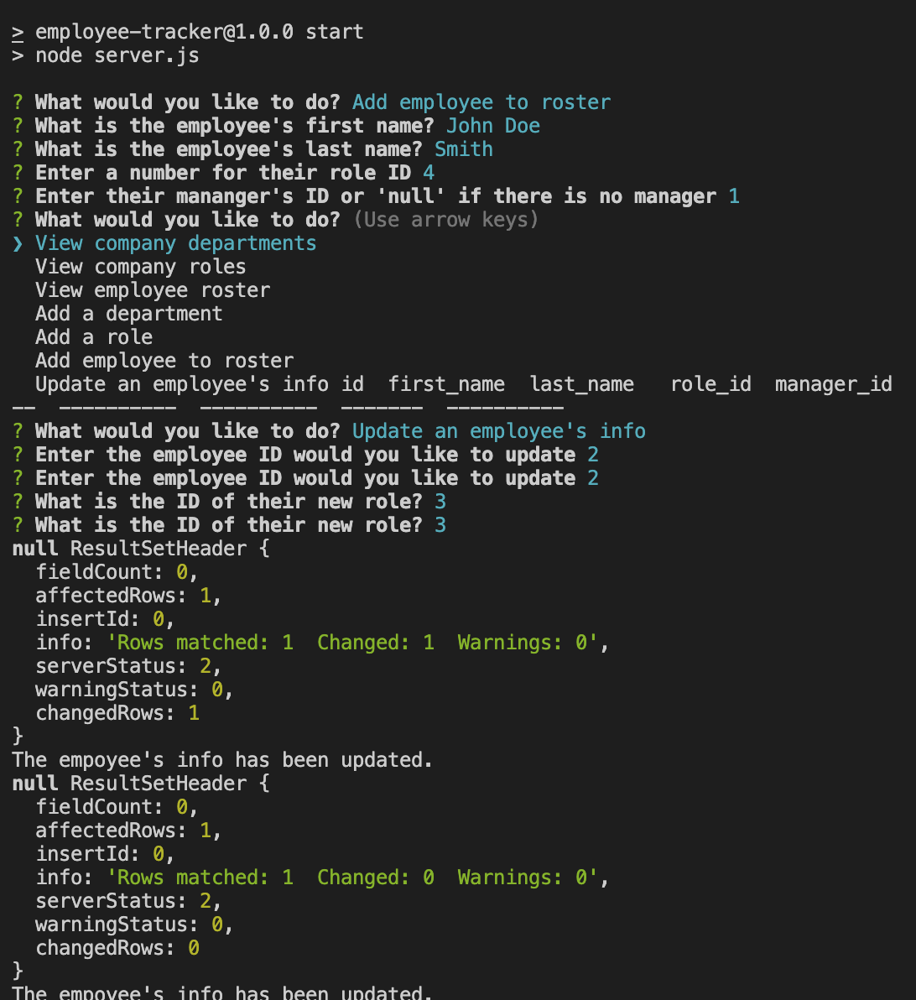

  

# Project Name: Employee-Tracker
https://github.com/annielnguyen/Employee-Tracker
## Description
This is a command-line application used to manage a company's employee database. Users can view company roles, employee roster, add departments, add roles, add employees, add salaries, update roles and corresponding department/employee/manager's ID's.
## Table of Contents
  
* [License](#license)
* [Installation](#installation)
* [Usage](#usage)
* [Contribution](#contribution)
* [Tests](#tests)
* [Questions](#questions)
  

## License
This project is licensed under the MIT license. 
  
## Installation
  Please install these dependencies to run this application: Node.js, Inquirer, and MySQL2.
  
## Usage
  To use this app, type "npm start" in your terminal and run it.  
  View my demo here: 
  

# Project Name: Employee-Tracker
https://github.com/annielnguyen/Employee-Tracker
## Description

## Table of Contents
  
* [License](#license)
* [Installation](#installation)
* [Usage](#usage)
* [Contribution](#contribution)
* [Tests](#tests)
* [Questions](#questions)
  

## License
This project is licensed under the MIT license. 
  
## Installation
  Please install these dependencies to run this application: 
  
## Usage
  To use this app, 
  Please click here to view my demo: https://watch.screencastify.com/v/ztpf4GLbIvZzJxHJ4tct

  
  

## Contribution
  ​Contributors: n/a

## Tests
  The following is needed to run the test: n/a

## Questions
  My GitHub profile link is: https://github.com/annielnguyen.
  If you have any questions regarding this app, please contact directly at: anguyen.aln@gmail.com.
  